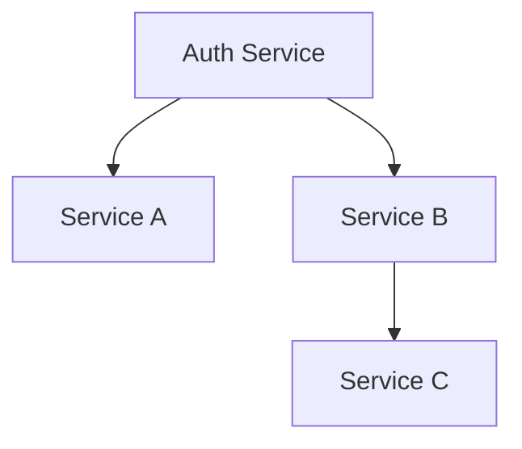
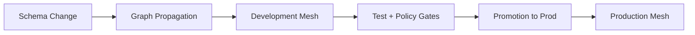

# Software Graph

> Designing contract-driven software systems that evolve safely.

Software Graph is an experimental systems initiative focused on treating APIs and service contracts as first-class graph assets.

Instead of thinking about services as isolated units, Software Graph models distributed systems as dependency graphs of contracts — enabling traceability, structured evolution, and deterministic change propagation.

---

## Core Principles

- **OpenAPI as Canonical Contract**
- **Structured Schema Evolution**
- **Graph-Based Dependency Modeling**
- **Deterministic Change Propagation**
- **Separation of Dev and Prod Meshes**
- **Distributed Verification via JWT + JWKS**
- **Automation-Ready Architecture**

---

## Conceptual Model

Services are modeled as nodes in a directed graph.

Edges represent explicit contract dependencies.

When a contract changes, the graph determines:

- What depends on it
- Whether the change is additive or breaking
- What must be forked in the development mesh
- What must pass before promotion

---

## Dev / Prod Mesh Architecture

Software Graph separates evolution from stability.

The development mesh absorbs structural change.  
The production mesh remains stable until validation succeeds.

---

## Authentication Model

The system uses:

- Self-contained JWT access tokens
- Distributed signature verification via JWKS
- Structured scopes for forward-compatible authorization
- Audience-based service isolation
- Explicit introspection for debugging and edge cases

Contracts are modeled explicitly to allow safe evolution.

---

## Why This Exists

Modern distributed systems suffer from:

- Implicit coupling
- Undetected breaking changes
- Incomplete contract modeling
- Runtime discovery of incompatibility
- Manual propagation of schema changes

Software Graph explores an alternative:

> Make the contract graph explicit.  
> Make change classification deterministic.  
> Make propagation structured.  
> Make automation possible.

---

## Status

This organization is currently in active experimental development.

Core areas under exploration:

- Contract graph modeling
- Schema diff classification
- Mesh propagation mechanics
- Policy-based change gating
- Autonomous update pipelines

---

## License

TBD

---

Software Graph is an ongoing exploration into how software systems can evolve with stronger guarantees, clearer contracts, and graph-level traceability.
